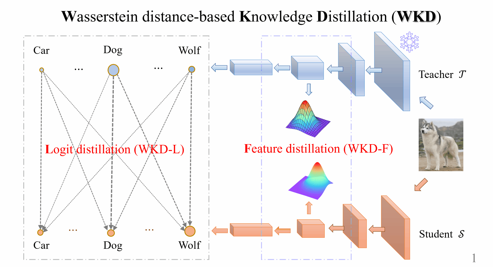

# Wasserstein Distance Rivals Kullback-Leibler Divergence for Knowledge Distillation

In this repo, we provide the offical implementation of this paper:

[NeurIPS2024] "Wasserstein Distance Rivals Kullback-Leibler Divergence for Knowledge Distillation"
[[Project]](http://peihuali.org/WKD)  [[Paper]](https://arxiv.org/abs/2412.08139).


<div style="text-align:center"></div>


# Introduction


In this paper, We propose a novel methodology of Wasserstein distance based knowledge distillation (WKD), extending beyond the classical Kullback-Leibler divergece based one pioneered by Hinton et al. Specifically, 
- We present a discrete WD based logit distillation method (`WKD-L`). It can leverage rich interrelations among classes via cross-category comparisons between predicted probabilities of the teacher and student, overcoming the downside of category-to-category KL divergence.

- We introduce continuous WD into intermediate layers for feature distillation (`WKD-F`). It can effectively leverage geometric structure of the Riemannian space of Gaussians, better than geometryunaware KL-divergence.

We hope our work can shed light on the promise of WD and inspire further interest in this metric in knowledge distillation.


# Citation
If this repo is helpful for your research, please consider citing the paper:

```BibTeX
@inproceedings{WKD_NeurIPS2024,
  title={Wasserstein Distance Rivals Kullback-Leibler Divergence for Knowledge Distillation},
  author={Jiaming Lv and Haoyuan Yang and Peihua Li},
  booktitle={Advances in Neural Information Processing Systems},
  year={2024}
}
```

# Experiments

We evaluate WKD for image classification on ImageNet and CIFAR-100, following the settings of [CRD](https://github.com/HobbitLong/RepDistiller).

### Image Classification On ImageNet

<table>
  <thead>
    <tr>
      <!-- <th rowspan="2">Strategy</th> -->
      <th rowspan="2">Method</th>
      <th colspan="3" style="text-align:center;">ResNet34 -&gt; ResNet18</th>
      <th colspan="3" style="text-align:center;">ResNet50 -&gt; MobileNetV1</th>
    </tr>
    <tr>
      <th>Top-1</th>
      <th>Model</th>
      <th>Log</th>
      <th>Top-1</th>
      <th>Model</th>
      <th>Log</th>
    </tr>
  </thead>
  <tbody>
    <tr>
      <!-- <td>Logit</td> -->
      <td>WKD-L</td>
      <td>72.49</td>
      <td><a href="https://drive.google.com/drive/folders/1lpI1Zvhkmap8xm-vyZrr2AFMXkH4YdaE?usp=sharing">Model</td>
      <td><a href="https://drive.google.com/file/d/12MDAQOUNnetqJm6YltWJZf3r0-UAViJP/view?usp=sharing">Log</td>
      <td>73.17</td>
      <td><a href="https://drive.google.com/drive/folders/1G3waI16yYZPd3hiQGKvW0wAn-tHIc25G?usp=sharing">Model</td>
      <td><a href="https://drive.google.com/file/d/1EbDLv0o0lIvv5KyscE9eNVGtouVFMniQ/view?usp=sharing">Log</td>
    </tr>
    <tr>
      <!-- <td>Feature</td> -->
      <td>WKD-F</td>
      <td>72.50</td>
      <td><a href="https://drive.google.com/drive/folders/1lpI1Zvhkmap8xm-vyZrr2AFMXkH4YdaE?usp=sharing">Model</td>
      <td><a href="https://drive.google.com/file/d/1cTMu4vYI3XvDa7Kz9E7ItsSoe9hMiEns/view?usp=sharing">Log</td>
      <td>73.12</td>
      <td><a href="https://drive.google.com/drive/folders/1G3waI16yYZPd3hiQGKvW0wAn-tHIc25G?usp=sharing">Model</td>
      <td><a href="https://drive.google.com/file/d/1N-fyA78Z6z_zhygwP7j29BymtzXhun6v/view?usp=sharing">Log</td>
    </tr>
    <tr>
      <!-- <td>Logit+Feature</td> -->
      <td>WKD-L+WKD-F</td>
      <td>72.76</td>
      <td><a href="https://drive.google.com/drive/folders/1lpI1Zvhkmap8xm-vyZrr2AFMXkH4YdaE?usp=sharing">Model</td>
      <td><a href="https://drive.google.com/file/d/1JSgPjTElbJdY3uQXcjvIjuqpIYGhUwnx/view?usp=sharing">Log</td>
      <td>73.69</td>
      <td><a href="https://drive.google.com/drive/folders/1G3waI16yYZPd3hiQGKvW0wAn-tHIc25G?usp=sharing">Model</td>
      <td><a href="https://drive.google.com/file/d/1DczvEC1-PW34TUmCfhLaZIOgNOD2tCO2/view?usp=sharing">Log</td>
    </tr>
  </tbody>
</table>

### Image Classification On CIFAR-100

<table>
  <thead>
    <tr>
      <!-- <th rowspan="2">Strategy</th> -->
      <th rowspan="2">Method</th>
      <th colspan="3" style="text-align:center;">RN32x4 -&gt; RN8x4</th>
      <th colspan="3" style="text-align:center;">WRN40-2 -&gt; SNV1</th>
    </tr>
    <tr>
      <th>Top-1</th>
      <th>Model</th>
      <th>Log</th>
      <th>Top-1</th>
      <th>Model</th>
      <th>Log</th>
    </tr>
  </thead>
  <tbody>
    <tr>
      <!-- <td>Logit</td> -->
      <td>WKD-L</td>
      <td>76.53</td>
      <td><a href="https://drive.google.com/drive/folders/1cpevHYCFywcgzWiB62VyYrtLxXoWE7KS?usp=sharing">Model</td>
      <td><a href="https://drive.google.com/file/d/1jNo8DwgTY1aj2mr-s1BpYJ-0bomI1Mfq/view?usp=sharing">Log</td>
      <td>76.72</td>
      <td><a href="https://drive.google.com/drive/folders/1oRkaCX22KvrRvvMSBk7sSKwIcH4xBZT-?usp=sharing">Model</td>
      <td><a href="https://drive.google.com/file/d/1UENkuRzeeBkx0spHcN_8U6eWy9JElks9/view?usp=sharing">Log</td>
    </tr>
    <tr>
      <!-- <td>Feature</td> -->
      <td>WKD-F</td>
      <td>76.77</td>
      <td><a href="https://drive.google.com/drive/folders/1cpevHYCFywcgzWiB62VyYrtLxXoWE7KS?usp=sharing">Model</td>
      <td><a href="https://drive.google.com/file/d/1MzPrms-I5a86Bzd69R8vHMPPnvrW4zUx/view?usp=sharing">Log</td>
      <td>77.36</td>
      <td><a href="https://drive.google.com/drive/folders/1oRkaCX22KvrRvvMSBk7sSKwIcH4xBZT-?usp=sharing">Model</td>
      <td><a href="https://drive.google.com/file/d/1mY1a2TNvQ3E8KoccumbKtfyHh6SxiqfT/view?usp=sharing">Log</td>
    </tr>
    <tr>
      <!-- <td>Logit+Feature</td> -->
      <td>WKD-L+WKD-F</td>
      <td>77.28</td>
      <td><a href="https://drive.google.com/drive/folders/1cpevHYCFywcgzWiB62VyYrtLxXoWE7KS?usp=sharing">Model</td>
      <td><a href="https://drive.google.com/file/d/17BNcti4jQQTEv8qoCQF1ssBPBjiOHDtY/view?usp=sharing">Log</td>
      <td>77.50</td>
      <td><a href="https://drive.google.com/drive/folders/1oRkaCX22KvrRvvMSBk7sSKwIcH4xBZT-?usp=sharing">Model</td>
      <td><a href="https://drive.google.com/file/d/1WcwJYcTNH2hYCR_SMvqa9Gnp0off8Ted/view?usp=sharing">Log</td>
    </tr>
  </tbody>
</table>


# Installation
Note that the test accuracy may slightly vary with different Pytorch/CUDA versions, GPUs, etc. All our experiments are conducted on a PC with an Intel Core i9-13900K CPU and GeForce RTX 4090 GPUs.

### Environments:

We recommend using the [Pytorch NGC Containers](https://catalog.ngc.nvidia.com/orgs/nvidia/containers/pytorch) environment provided by NVIDIA to reproduce our method. This environment contains

- CUDA 12.1
- Python 3.8
- PyTorch 2.1.0
- torchvision 0.16.0

First, please make sure that Docker Engine is installed on your device by referring to this [installation guide](https://docs.docker.com/engine/install/ubuntu/). Then, use the following command to pull the docker image:

```
docker pull nvcr.io/nvidia/pytorch:23.04-py3
```

Run the docker image and enter the container with the following command:
```
docker run --name wkd -dit --gpus=all nvcr.io/nvidia/pytorch:23.04-py3 /bin/bash
```

Note: If you are unable to use Docker, you can try manually installing the PyTorch environment. It is recommended to keep the environment consistent with the one in the NGC Container.

### Clone this repo:

Clone this repo in NGC Container:
```
git clone https://github.com/JiamingLv/WKD.git
cd WKD
```


And then install the extra package:

```
pip install -r requirements.txt
python setup.py develop
```

# Getting started

1. Generate cost matrix offline for WKD-L
- We have provided the cost matrix in `wkd_cost_matrix`. If you want to regenerate the cost matrix, run `generate_cost_matrix.sh`
  ```bash
  sh generate_cost_matrix.sh
  ```   


1. Training on ImageNet

- Put the ImageNet dataset to default path `data/imagenet`. And you can change this path by modifing the variable `data_folder` in `mdistiller/dataset/imagenet.py`.

  ```bash
  # for instance, our WKD-L method.
  python3 tools/train.py --cfg configs/imagenet/r34_r18/wkd_l.yaml
  ```


2. Training on CIFAR-100

- Download the `cifar_teachers.tar` provided by [DKD](https://github.com/megvii-research/mdistiller/releases/tag/checkpoints) and untar it to `./download_ckpts` via `tar xvf cifar_teachers.tar`.

  ```bash
  # for instance, our WKD-L method.
  python3 tools/train.py --cfg configs/cifar100/wkd_l/res32x4_res8x4.yaml
  ```


# Acknowledgement

- Thanks for DKD. We build this repo based on the [mdistiller provided by DKD](https://github.com/megvii-research/mdistiller).

- We thank OFA for [the codebase](https://github.com/Hao840/OFAKD), NKD for [the codebase](https://github.com/yzd-v/cls_KD), CRD for [the codebase](https://github.com/HobbitLong/RepDistiller), and ReviewKD for [the codebase](https://github.com/dvlab-research/ReviewKD).

- Thanks also go to authors of other papers who make their code publicly available.

# Contact
If you have any questions or suggestions, please contact us:

- Jiaming Lv (ljm_vlg@mail.dlut.edu.cn)

- Haoyuan Yang (yanghaoyuan@mail.dlut.edu.cn)